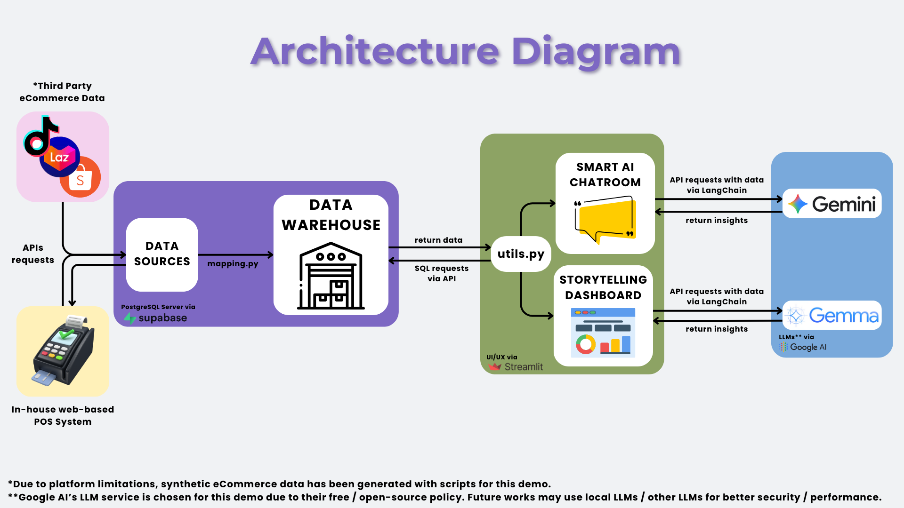

# Project Title: Insight 


**Insight** is a unified sales analytics platform that consolidates sales data from multiple sources such as Shopee, TikTok, Lazada, and a demo Point-of-Sale (POS) system, into one central dashboard.
The goal is to provide businesses with actionable insights, enabling them to understand performance across various sales channels without needing to juggle multiple reports. 
It combines **real-time dashboards**, **AI storytelling for KPIs**, and an **interactive AI assistant** to query sales data, enabling smarter and faster decision-making.

---
## Table of Contents

- [Problem Statement](#problem-statement-ai-driven-automation-for-business-growth)
- [Solution](#solution)
- [Tech Stack](#tech-stack)
- [Setup Instructions](#setup-instructions)
- [Reflection](#reflection)
- [License](#license)

---
## Problem Statement: AI-Driven Automation for Business Growth
Many SMEs and online sellers face the challenge of:
- Fragmented sales data spread across multiple platforms.
- Manual reporting that is time-consuming and error-prone.
- Limited ability to gain real-time insights for decision-making.
  
---

## Solution
Insight solves this by:
- Integrating multi-channel sales data into a single warehouse.
- Interactive dashboard for KPIs, trends, and product analysis.
- AI-driven storytelling for auto-generated insights (e.g., trends, composition, inventory health).
- AI chatroom for querying the database in plain English instead of writing SQL, enabling faster decision-making.
- Demo POS system to simulate offline sales and test integrations.


---

## Tech Stack



- Frontend/Dashboard: Streamlit
- Backend/API: FastAPI (server.py for POS system)
- Database: PostgreSQL (with sales fact & dimension tables)
- AI Models: Google API (for AI storytelling + chatroom)
- Others: Python, Pandas, LangChain

---

## Setup Instructions
### 1. Clone the Repository
```bash
# Clone the repo
git clone https://github.com/huiying888/Insight.git
cd Insight
```
### 2. Configure Environment Variables
Download the .env file (not provided in GitHub).

Place it inside the `/config` folder.

### 3. Install the required packages
```bash
pip install -r requirements.txt
```
### 4. Run the Main AI Storytelling Dashboard 
```bash
python -m streamlit run main.py
```
### 5. Run the POS System (demo)
```bash
# to insert data from pos system and automatically map to data warehouse
python webapp/server.py
```

---

## Reflection
Challenges:
- Consolidating multi-source sales data (Shopee, TikTok, Lazada, POS).
- Building an AI layer that balances accuracy with storytelling clarity.
- Handling SQL execution errors and ensuring the AI chatroom correctly maps natural questions to database queries.

Learnings:
- AI can greatly simplify business reporting by translating raw metrics into narratives.
- Combining structured dashboards with unstructured Q&A creates more flexibility for users.
- Designing a POS prototype helps demonstrate integration feasibility for offline sales.


## Team: LaiChai

- Jocelyn Ngieng Hui Ying : [@huiying888](https://github.com/huiying888)
- Ng Ker Jing : [@kerjing0328](https://github.com/kerjing0328)
- Sia Sheng Jie : [@sia1010](https://github.com/sia1010)
- Teoh Yi Jen : [@Yijen10](https://github.com/Yijen10)
- Chai Woon Hue : [@rav-pixel-cpu](https://github.com/rav-pixel-cpu)

---

## License
MIT License — free to use and modify.
